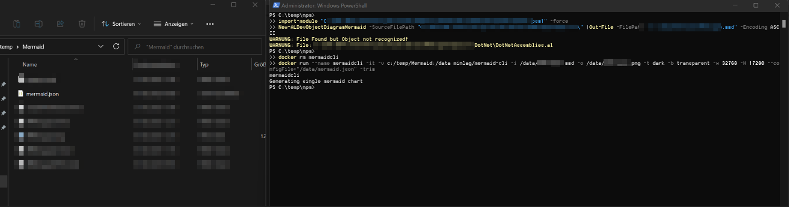
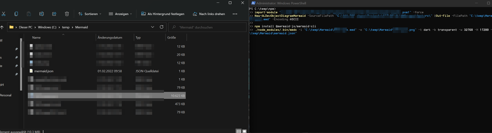

# New-BCALMermaidClassDiagram

Mit "New-BCALMermaidClassDiagram" wird für [Mermaid](https://mermaid-js.github.io/mermaid/#/n00b-gettingStarted) der Klassendiagramm-Code generiert.
Mit Hilfe von "| Set-Clipboard" kann der Code in den Zwischenspeicher gepspeichert und auf [Mermaid.live](https://mermaid.live/) eingefügt werden.

Falls Komplexere Diagramme dargestellt werden sollen, kann MermaidJS installiert werden. Dies geht am einfachsten mit npm. 

## Unterstützte Objekt Arten

Derzeit werden diese Objektarten mit Eigenschaften analysiert und angezeigt.

- Tabellen
  - TableRelations

## mermaid-cli

mermaid-cli ist die MermaidJS Konsolenanwendung mit der Diagramme via Code erstellt werden können. Die Software kann installiert verschieden verwendet/installiert werden:
GitHub Repo: [mermaid-cli](https://github.com/mermaid-js/mermaid-cli)

## Vorbereitete Daten

FÜr das Mermaid-Diagramm erstellen wir einen Ordner und legen die erzeugten Mermaid Diagramm Code Dateien ab (*.mmd).
Mittels "New-BCALMermaidClassDiagram" können die Diagramm Code Dateien für MermaidJS aus einem AL Projekt erzeugt werden.

Dazu wird die mermaid.json Config Datei benötigt:
Inhalt der mermaid.json:

```json
{
    "maxTextSize" : 99999999,
    "useMaxWidth": true,
    "useMaxHeight": true,
    "wrap": true
}
```

Damit können auch größere MermaidJS Projekte gerendert werden.

### Mermaid mit Docker

Hier wird ein Linux Docker Container benötigt. Weiter muss das Image geladen und die Dateien wie beschrieben vorbereitet sein.

Docker Image herrunterladen:

```docker
docker pull minlag/mermaid-cli
```

Mit dem folgenden Befehl wird der Docker Container angelegt der das Bild erstellt. Wichtig sind die Parameter zu beachten.

```git
docker run --name mermaidcli -it -v c:/temp/Mermaid:/data minlag/mermaid-cli -i /data/MermaidClassDiagramm.mmd -o /data/MermaidClassDiagramm.png -t dark -b transparent -w 32768 -H 17280 --configFile="/data/mermaid.json" -trim
```

Die erstellten "mmd" Dateien liegen in diesem Beispiel im "c:/temp/Mermaid" Ordner.

Links im Screenshot sind die Dateien abgebidert und ungefähr so könnte der Befehl aussehen.



## Mermaid mit npm

Dies ist meine Favorisierte Versiom. 
Um Mermaid-cli mit npm zu installieren, muss dies node.JS und npm installiert werden.
Damit eifach auf deinem Windiws Rechner Software installieren kannst, verwenden wir hier "Chocolatey".

### Chocolatey installieren

Chocholatey installieren: [https://chocolatey.org/install](https://chocolatey.org/install)

Oder In PowerShell diesen Code ausführen:

```PowerShell
Set-ExecutionPolicy Bypass -Scope Process -Force; [System.Net.ServicePointManager]::SecurityProtocol = [System.Net.ServicePointManager]::SecurityProtocol -bor 3072; iex ((New-Object System.Net.WebClient).DownloadString('https://community.chocolatey.org/install.ps1'))
```

### Node.js (und npm) installieren

Um mit Chocolatey Node.js und damit npm zu installieren, kann wieder in der PowerShell dies ausgeführt werden:

```PowerShell
choco install nodejs --version 14.15.5 -y
```

Quelle: [https://community.chocolatey.org/packages/nodejs](https://community.chocolatey.org/packages/nodejs)


### Mermaid installieren

Nun kann mit npm in einem ausgewählten Ordner mermaid installiert werden.

```PowerShell
npm install @mermaid-js/mermaid-cli
```

Und darauf kann mermaid-cli verwendet werden:

```PowerShell
./node_modules/.bin/mmdc -i "C:\temp\Mermaid\MermaidClassDiagramm.mmd" -o "C:\temp\Mermaid\MermaidClassDiagramm.png" -t dark -b transparent -w 32768 -H 17280 -c "C:\temp\Mermaid\mermaid.json"
```




### OneScript for all

Hier ein gesamt Script zum kopieren wo nur die Oberen Variablen verändert werden müssen.

```PowerShell
$ALSourceCodePath = "C:\temp\BCProject\App\src"
$MermaidMMDDestinationPath = "C:\temp\Mermaid\MermaidClassDiagramm.mmd"
$MermaidPngDestinationPath = "C:\temp\Mermaid\MermaidClassDiagramm.png"
$MermaidConfigFile = "C:\temp\Mermaid\mermaid.json"
$MermaidExecutionPath = "C:\temp\Mermaid\"

cd $MermaidExecutionPath

import-module "C:\temp\BCALDevHelper\BCALDevHelper.psm1" -force
$ALObjects = Get-BCALObjects -SourceFilePath $ALSourcecodePath 

New-BCALMermaidClassDiagram -ALObjects $ALObjects -verbose | Out-File -FilePath $MermaidMMDDestinationPath -Encoding ASCII 

npm install @mermaid-js/mermaid-cli
./node_modules/.bin/mmdc -i $MermaidMMDDestinationPath -o $MermaidPngDestinationPath -t dark -b transparent -w 32768 -H 17280 -c $MermaidConfigFile
```
